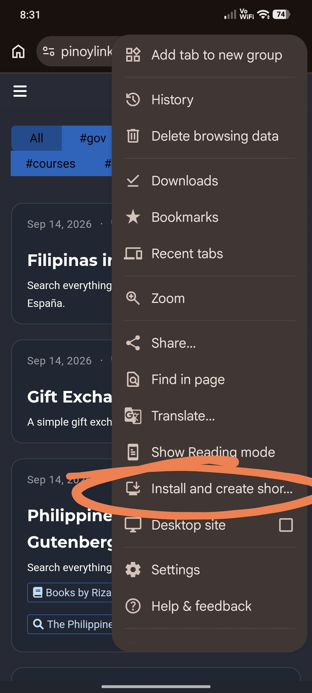
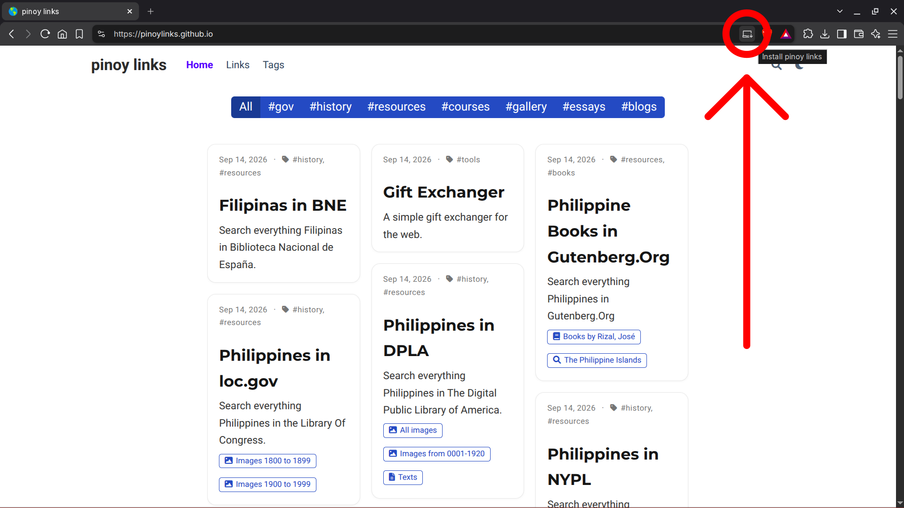

+++
# A Demo section created with the Blank widget.
# Any elements can be added in the body: https://wowchemy.com/docs/writing-markdown-latex/
# Add more sections by duplicating this file and customizing to your requirements.

widget = "markdown"  # See https://wowchemy.com/docs/page-builder/
headless = true  # This file represents a page section.
active = true  # Activate this widget? true/false
weight = 30  # Order that this section will appear.

title = "How to install pinoy links"
subtitle = ""

[design]
  # Choose how many columns the section has. Valid values: 1 or 2.
  columns = "1"

# [design.spacing]
  # Customize the section spacing. Order is top, right, bottom, left.
  # padding = ["20px", "0", "20px", "0"]

[advanced]
 # Custom CSS. 
 css_style = ""
 
 # CSS class.
 css_class = ""
+++

### In Mobile

1. Go to https://pinoylinks.github.io/ (not in incognito mode).
2. Go to Menu.
3. Install and create shortcut.

### In Desktop

1. Go to https://pinoylinks.github.io/ (not in incognito mode).
2. In address bar, Click install pinoy links.

