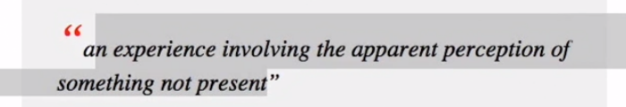
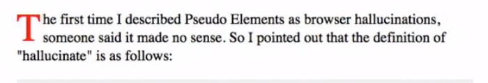
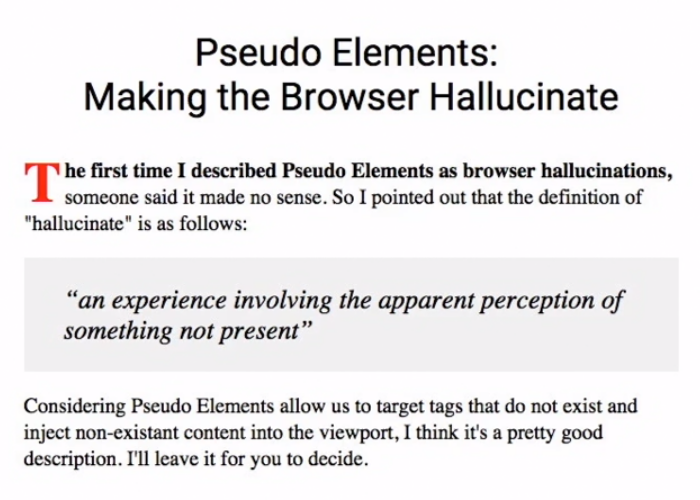
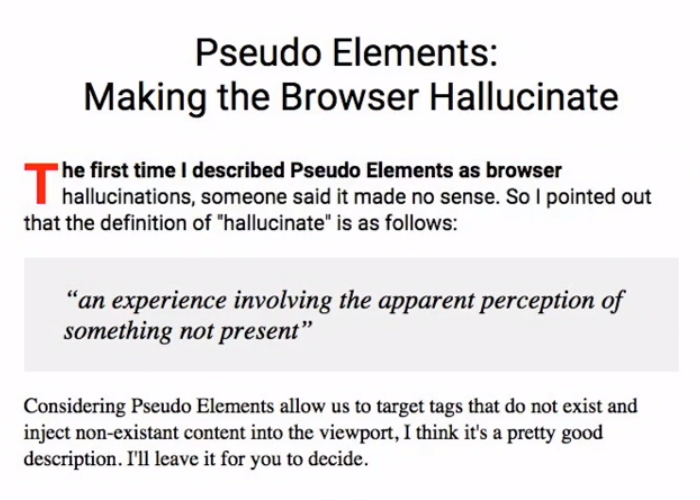
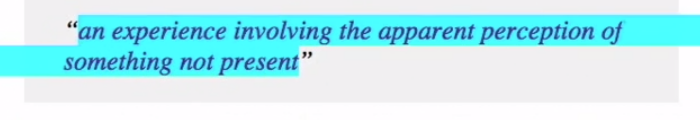



## ::before and ::after

```css
blackquote::before {
    content: "“";
    font-size: 2em;
    color: red;
}

blackquote::after {
    content: "”";
}
```



## ::first-letter

```css
.container::first-letter {
    color: red;
    font-size: 2.7em;
    float: left;
    line-height: .9em;
    padding-right: 3px;
}
```



## ::first-line

```css
.container::first-line {
    font-weight: 700;
}
```



### :first-of-type

{}
And, in case you're wondering, if you want to target the first item of a series, let's say the first paragraph of an article, you can do so using the `pseudo selector, first of type`.
{}

```css
p:first-of-type {
    font-family: Roboto;
}
```



## ::selection

```css
blackquote::selection{
    background-color: aqua;
    color: rebeccapurple;
}
```


